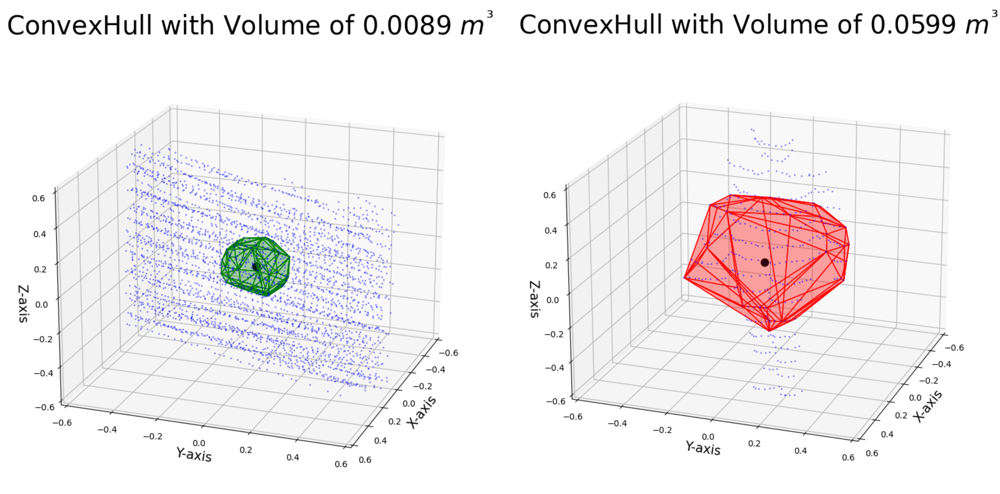

# DynaHull

DynaHull: Density-centric Dynamic Point Filtering in Point Clouds

This study introduces DynaHull, a novel technique designed to enhance indoor mapping accuracy by effectively removing dynamic points from point clouds. DynaHull works by leveraging the observation that, over multiple scans, stationary points have a higher density compared to dynamic ones. Furthermore, DynaHull addresses mapping challenges related to unevenly distributed points by clustering the map into smaller sections.


*Estimating convex hull volume between stationary and dynamic points: The left figure represents the stationary area (wall), while the picture on the right illustrates the dynamic area (human)*

## Required Libraries
- numpy
- scikit-learn
- open3d
- scipy
- glob
- os
- configparser

## Citation
Please cite our repo in your projects!

```
@misc{habibiroudkenar2024dynahull,
title={DynaHull: Density-centric Dynamic Point Filtering in Point Clouds},
author={Pejman Habibiroudkenar and Risto Ojala and Kari Tammi},
year={2024},
eprint={2401.07541},
archivePrefix={arXiv},
primaryClass={cs.RO}
}
```
